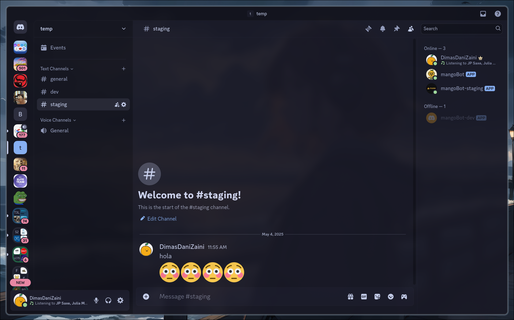
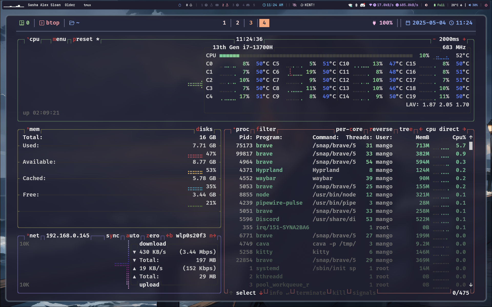
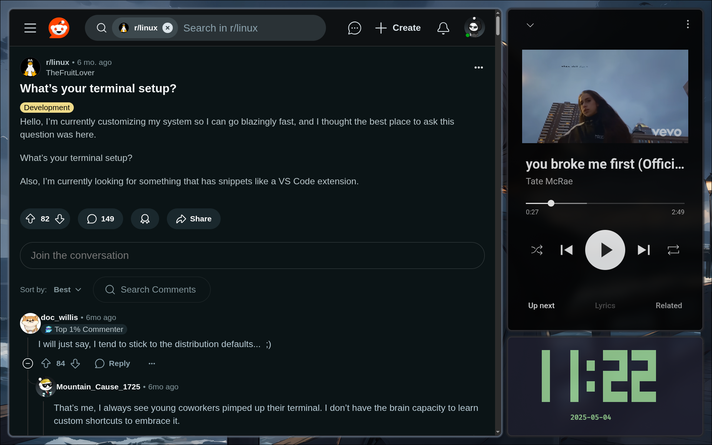
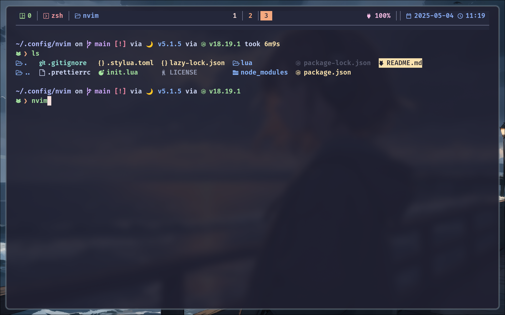
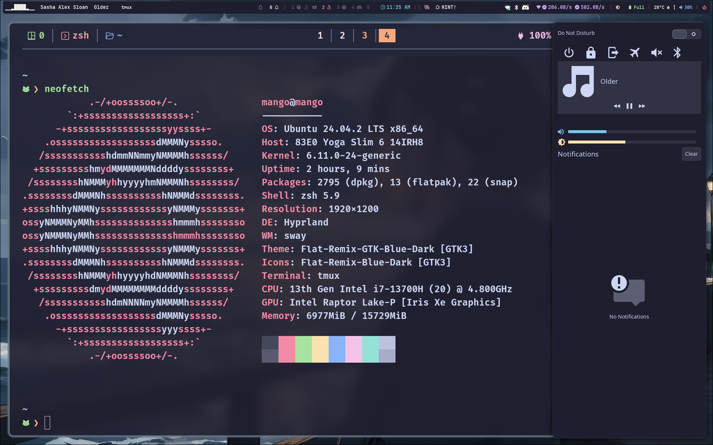
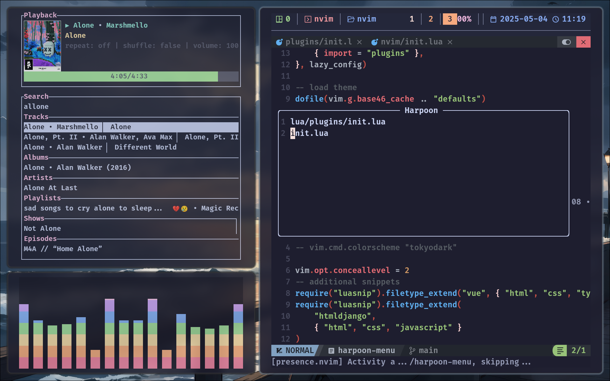
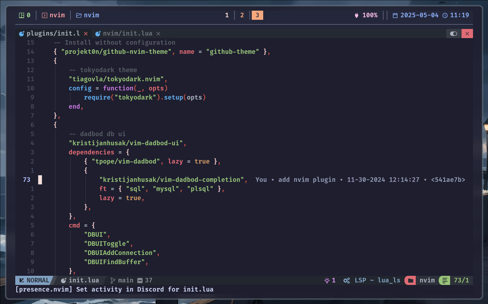

# Screenshot















> NOTE

To run app in the wayland feature, just use the following flags:
```bash
<app_name> --ozone-platform=x11 --enable-features=WaylandWindowDecorations
```

To fix obs and discord screen share, you need to add [xdg-desktop-portal-hyprland](https://github.com/hyprwm/xdg-desktop-portal-hyprland). Follow the instruction with some dependencies installed to build it from source. Then, add this to hyprland config
```bash
exec-once=dbus-update-activation-environment --systemd WAYLAND
```
Source: [Screen sharing on Hyprland (Arch Linux)](https://gist.github.com/brunoanc/2dea6ddf6974ba4e5d26c3139ffb7580)